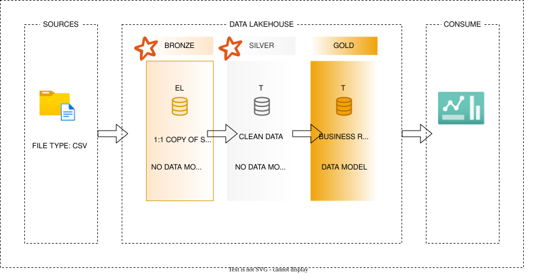

# German YouTube Analytics Pipeline

## 1. Project Overview

The **`German YouTube Analytics Pipeline`** is an end-to-end data engineering project designed to transform raw German YouTube channel data into reliable analytical datasets and interactive business insights.

The project demonstrates a modern batch-oriented data engineering architecture using:

* **`Python`** for application and pipeline logic
* **`Apache Spark / PySpark`** for large-scale data processing
* **`Parquet`** for analytical data storage
* **`Medallion Architecture`** for organizing data transformations
* **`DuckDB`** as a local analytical database
* **`dbt`** for SQL-based transformation, testing, documentation, and lineage
* **`Apache Airflow`** for workflow orchestration
* **`Docker`** for running Airflow in an isolated environment
* **`Streamlit`** for interactive analytics and visualization

The architecture follows an **ELT-oriented approach**:

> Extract → Load → Transform → Model → Serve

The goal is not merely to produce charts, but to demonstrate how a production-style data platform can be designed, tested, orchestrated, documented, and consumed.

---

# 2. Business Requirement

Before selecting technologies, the architecture begins with the business requirements.

One of the most important requirements is **`data latency`**.

Latency answers the question:

> How long can the business tolerate waiting for updated data?

For this project, the data does not need to be updated in real time. Therefore, the system is designed as a **`batch processing pipeline`**.

This architectural decision significantly reduces unnecessary complexity.

Because the system is batch-oriented, the project does not require technologies or concepts such as:

* Kafka
* Apache Flink
* Real-time event processing
* Streaming windows
* Out-of-order event handling
* Late-arriving streaming events
* Exactly-once streaming semantics
* At-least-once streaming semantics
* At-most-once streaming semantics

Instead, the architecture focuses on:

* Batch ingestion
* Data transformation
* Data quality
* Storage
* SQL analytics
* Scheduling
* Retries
* Monitoring
* Orchestration
* Documentation
* Business intelligence

---
# DATA ARCHITECTURE
---



# 3. Architectural Decision Process

The architecture was designed progressively rather than selecting technologies first.

The major decisions were:

1. Determine the business latency requirement.
2. Select batch processing.
3. Evaluate the data characteristics.
4. Select an appropriate storage architecture.
5. Select a data organization pattern.
6. Design the Bronze, Silver and analytical layers.
7. Introduce testing.
8. Introduce orchestration.
9. Introduce analytical SQL transformation with dbt.
10. Connect the analytical database to Streamlit.

This approach demonstrates an important data engineering principle:

> **Architecture should be driven by requirements, not by technology preferences.**

---

# 4. Data Characteristics

The source dataset contains information about YouTube channels in Germany.

Important attributes include:

* YouTuber/channel name
* Category
* Subscriber count
* Total video views
* Video count
* Channel rank
* Channel start year

The dataset contains **`1,000 channels`**, with the cleaned dataset containing **992 valid records**.

The data is fundamentally tabular and suitable for batch analytical processing.

---

# 5. Lakehouse Architecture

The project uses a simplified **`lakehouse-style architecture`**.

The architecture combines:

* File-based storage
* Structured transformations
* Analytical database capabilities
* SQL-based analytical modeling

The project follows a **Medallion Architecture**:

```text
Source
   │
   ▼
Bronze
   │
   ▼
Silver
   │
   ▼
DuckDB
   │
   ▼
dbt Analytical Models
   │
   ├──────────────► Streamlit
   │
   ▼
Analytical Consumers
```

The original architecture placed PySpark directly in the Gold layer.

The final architecture replaces that approach with *`DuckDB + dbt`* for analytical modeling.

---

# 6. Bronze Layer

## Purpose

The Bronze layer represents the first persistent copy of the source data.

Its primary objective is *`data preservation`*, not business transformation.

The Bronze layer follows an:

> **Extract + Load (EL)**

pattern.

The source data is extracted and loaded into the Bronze storage layer with minimal modification.

### Responsibilities

The Bronze layer is responsible for:

* Reading the source CSV data
* Preserving the source structure
* Performing basic ingestion validation
* Checking that the incoming dataset is not empty
* Performing preliminary schema validation
* Persisting the raw dataset in the pipeline

The Bronze layer deliberately avoids applying business logic.

### Principle

```text
Source Data ≈ Bronze Data
```

The Bronze layer should remain as close to the source as possible.

---

# 7. Silver Layer

The Silver layer is responsible for producing **`clean and reliable data`**.

This is where the first major transformation occurs.

The Silver layer is implemented using **`PySpark`**.

### Responsibilities

The Silver layer includes transformations such as:

* Cleaning data
* Removing duplicates
* Handling invalid records
* Standardizing fields
* Validating important columns
* Creating derived analytical fields

Examples of derived metrics include:

* `views_per_subscriber`
* `avg_views_per_video`

The Silver layer therefore represents:

> **Cleaned and transformed data suitable for analytical processing.**

The resulting Silver dataset contains the cleaned YouTube channel records.

---

# 8. Transition from PySpark Gold to dbt

Initially, the project used PySpark to produce the Gold analytical datasets.

However, as the project evolved, the analytical transformation layer was redesigned.

Instead of:

```text
Silver → PySpark Gold
```

the final architecture uses:

```text
Silver → DuckDB → dbt → Analytical Models
```

This separation provides a clearer distinction between:

### PySpark

Used for:

* Data processing
* Cleaning
* Deduplication
* Large-scale transformations

### dbt

Used for:

* SQL transformations
* Analytical modeling
* Business logic
* Data tests
* Documentation
* Dependency management
* Data lineage

This makes the project closer to a modern analytics engineering workflow.

---

# 9. DuckDB

DuckDB acts as the analytical database for the dbt layer.

The project uses DuckDB because it provides a lightweight local analytical database without requiring a separate database server.

The project creates:

```text
germany_youtube_analytics_pipeline_dbt/dev.duckdb
```

The cleaned Silver data is loaded into DuckDB as:

```text
raw.youtube_channels
```

The table contains the cleaned YouTube channel data.

DuckDB is particularly useful in this project because it can efficiently work with analytical data and Parquet files while remaining simple enough for local development.

---

# 10. dbt Staging Layer

dbt reads the raw table from DuckDB and creates a staging model.

The staging layer provides a controlled interface between the raw analytical data and downstream models.

Conceptually:

```text
raw.youtube_channels
        │
        ▼
stg_youtube_channels
```

The staging model provides a consistent dataset for downstream analytical models.

This also allows transformations to be expressed using SQL rather than embedding every analytical transformation inside Python.

---

# 11. dbt Analytics Layer

The analytical models implement the business logic required by the dashboard.

The current analytical layer contains:

### `channel_performance`

Provides channel-level analytical information including:

* YouTuber
* Category
* Subscribers
* Video views
* Video count
* Rank
* Started year
* Views per subscriber
* Average views per video
* Subscriber rank
* Views rank
* Content volume rank

### `category_performance`

Provides category-level metrics including:

* Total channels
* Total video count
* Total subscribers
* Total video views
* Average subscribers
* Average video count
* Average video views
* Average views per video
* Average views per subscriber

### `relationship_analysis`

Provides the analytical dataset required to investigate relationships between:

* Subscribers and video views
* Video volume and views
* Other channel-level performance metrics

The analytical models represent the project's **business-facing data layer**.

---

# 12. dbt Testing

One of the major advantages of introducing dbt is that analytical models can be tested systematically.

The project contains tests covering:

* Null values
* Uniqueness
* Valid ranks
* Positive subscriber values
* Positive video counts
* Positive video views
* Valid analytical metrics
* Business logic constraints

The final test execution produced:

```text
Found 4 models, 46 data tests, 1 source, 500 macros
```

and the majority of the tests passed successfully.

A uniqueness failure was discovered for the channel name `Rtl`.

Investigation showed that the source contained two legitimate records:

```text
Rtl News & Politics
Rtl Entertainment
```

This exposed an important data modeling issue:

> A YouTube channel name alone is not necessarily a sufficient business key.

The test therefore helped reveal a real characteristic of the source data rather than simply validating that the code worked.

---

# 13. Data Quality Philosophy

The project applies data quality at multiple stages.

### Bronze

Checks include:

* Dataset is not empty
* Schema is broadly consistent

### Silver

Checks include:

* Duplicate removal
* Data cleaning
* Valid values
* Derived metric correctness

### dbt

Checks include:

* Not-null constraints
* Uniqueness
* Business rules
* Analytical model validation

This creates a layered quality-control strategy:

```text
Ingestion Quality
       ↓
Transformation Quality
       ↓
Analytical Quality
```

---

# 14. Apache Airflow

Apache Airflow is responsible for orchestrating the pipeline.

Airflow is not responsible for performing the actual data transformations.

Instead, it coordinates the execution of the different components.

The pipeline follows dependencies such as:

```text
Bronze
  ↓
Silver
  ↓
DuckDB Load
  ↓
dbt
  ↓
Streamlit-ready Analytics
```

Airflow ensures that downstream tasks do not execute before their dependencies have completed successfully.

---

# 15. Airflow and Docker

Airflow is deployed using Docker.

The project uses:

```text
airflow/docker-compose.yml
airflow/dockerfile.airflow
```

The Airflow Docker image extends the official Apache Airflow image.

The environment is configured with the dependencies required to execute the Spark-based pipeline.

Docker provides:

* Environment isolation
* Reproducibility
* Dependency management
* Consistent Airflow execution
* Easier migration to cloud infrastructure later

The project mounts the application code into the Airflow environment so that Airflow can access the pipeline implementation.

---

# 16. Orchestration Architecture

The final orchestration concept is:

```text
                    ┌──────────────┐
                    │ Source Data  │
                    └──────┬───────┘
                           │
                           ▼
                    ┌──────────────┐
                    │    Bronze    │
                    │   PySpark    │
                    └──────┬───────┘
                           │
                           ▼
                    ┌──────────────┐
                    │    Silver    │
                    │   PySpark    │
                    └──────┬───────┘
                           │
                           ▼
                    ┌──────────────┐
                    │    DuckDB    │
                    │   raw table  │
                    └──────┬───────┘
                           │
                           ▼
                    ┌──────────────┐
                    │     dbt      │
                    │ SQL Analytics│
                    └──────┬───────┘
                           │
                           ▼
                    ┌──────────────┐
                    │  Streamlit   │
                    │  Dashboard   │
                    └──────────────┘
```

Airflow sits above this workflow and controls the execution order.

---

# 17. Streamlit Dashboard

Streamlit provides the presentation layer.

The dashboard does not perform the main data transformations.

Instead, it consumes the analytical datasets produced by the dbt/DuckDB layer.

This creates a clean separation:

```text
Data Processing → PySpark
Data Modeling   → dbt
Storage         → DuckDB
Orchestration   → Airflow
Visualization   → Streamlit
```

This separation makes the application easier to maintain.

---

# 18. Dashboard Analytics

The dashboard provides several analytical views.

## Top Channels

Channels are ranked according to subscriber count.

This identifies the most subscribed German YouTube channels in the dataset.

## Category Performance

Two major category dimensions are examined:

### Average Views by Category

This measures average video views associated with each category.

### Content Volume by Category

This measures the total number of videos associated with each category.

## Relationship Analysis

The dashboard examines relationships between:

### Subscribers vs. Video Views

This helps determine whether channels with more subscribers tend to generate more total views.

### Content Volume vs. Average Views

This investigates whether producing more content is associated with higher average views.

---

# 19. Key Analytical Findings

The dashboard revealed several important observations.

### Channel Performance

The highest-performing channels by subscriber count are concentrated among a relatively small number of large channels.

### Category Performance

The **Shows** category has the highest average views in the dataset, at approximately:

```text
2.779 billion average views
```

### Content Volume

The **Gaming** category has the largest content volume, with approximately:

```text
384,064 videos
```

followed by categories such as Entertainment and News & Politics.

### Subscriber and View Relationship

Subscriber count and total video views show a positive relationship.

This suggests that channels with larger subscriber bases generally tend to accumulate more total video views.

### Content Volume and Average Views

The relationship between content volume and average views appears substantially weaker.

This suggests that simply producing more videos does not necessarily guarantee higher average views per video.

These observations should be interpreted as relationships in the dataset rather than proof of direct causation.

---

# 20. Documentation and Lineage

dbt also provides documentation and lineage for the analytical layer.

The dependency structure can be represented as:

```text
raw.youtube_channels
          │
          ▼
stg_youtube_channels
          │
          ├──────────────► channel_performance
          │
          ├──────────────► category_performance
          │
          └──────────────► relationship_analysis
```

This lineage makes it possible to understand:

* Where data originates
* Which transformations depend on which models
* How analytical tables are produced
* Which upstream changes could affect downstream models

This is particularly valuable as the project grows.

---

# 21. Final Technology Architecture

The completed project can therefore be summarized as:

| Layer              | Technology | Responsibility                         |
| ------------------ | ---------- | -------------------------------------- |
| Source             | CSV        | Raw YouTube data                       |
| Bronze             | PySpark    | Extraction and loading                 |
| Silver             | PySpark    | Cleaning and transformation            |
| Analytical Storage | DuckDB     | Local analytical database              |
| Staging            | dbt        | SQL staging                            |
| Analytics          | dbt        | Business logic and analytical modeling |
| Testing            | dbt        | Data quality and business tests        |
| Orchestration      | Airflow    | Workflow coordination                  |
| Runtime            | Docker     | Airflow environment                    |
| Presentation       | Streamlit  | Interactive dashboard                  |

---

# 22. Final End-to-End Architecture

The complete system can be represented as:

```text
                         ┌──────────────────────┐
                         │      SOURCE CSV      │
                         └──────────┬───────────┘
                                    │
                                    ▼
                         ┌──────────────────────┐
                         │       BRONZE         │
                         │       PySpark        │
                         │                      │
                         │   Extract + Load     │
                         └──────────┬───────────┘
                                    │
                                    ▼
                         ┌──────────────────────┐
                         │       SILVER         │
                         │       PySpark        │
                         │                      │
                         │ Clean + Deduplicate  │
                         │ Transform + Validate │
                         └──────────┬───────────┘
                                    │
                                    ▼
                         ┌──────────────────────┐
                         │       DUCKDB         │
                         │                      │
                         │ raw.youtube_channels │
                         └──────────┬───────────┘
                                    │
                                    ▼
                         ┌──────────────────────┐
                         │         dbt          │
                         │                      │
                         │       STAGING        │
                         │          ↓           │
                         │       ANALYTICS       │
                         └──────────┬───────────┘
                                    │
                    ┌───────────────┼────────────────┐
                    │               │                │
                    ▼               ▼                ▼
          ┌────────────────┐ ┌───────────────┐ ┌──────────────────┐
          │    Channel     │ │   Category    │ │   Relationship   │
          │  Performance   │ │  Performance  │ │     Analysis     │
          └────────────────┘ └───────────────┘ └──────────────────┘
                    │               │                │
                    └───────────────┼────────────────┘
                                    │
                                    ▼
                         ┌──────────────────────┐
                         │      STREAMLIT       │
                         │      DASHBOARD       │
                         └──────────────────────┘


                 ┌──────────────────────────────────┐
                 │            AIRFLOW               │
                 │                                  │
                 │  Orchestrates the entire flow   │
                 └──────────────────────────────────┘

                 ┌──────────────────────────────────┐
                 │             DOCKER               │
                 │                                  │
                 │   Provides Airflow runtime       │
                 └──────────────────────────────────┘
```

---

# 23. Why This Architecture?

The final architecture intentionally separates responsibilities.

### PySpark

Handles computational data transformation.

### DuckDB

Provides a lightweight analytical database.

### dbt

Handles SQL transformation, business logic, testing, documentation, and lineage.

### Airflow

Handles orchestration and dependencies.

### Docker

Provides a reproducible execution environment.

### Streamlit

Provides the user-facing analytical interface.

This separation follows the principle:

> **One component should have a clear responsibility.**

---

# 24. Engineering Lessons

The project demonstrates several important data engineering concepts.

### 1. Start with requirements

Technology selection should follow the business problem.

### 2. Latency determines architecture

A batch requirement eliminates unnecessary streaming complexity.

### 3. Medallion architecture separates concerns

Bronze preserves, Silver cleans, and the analytical layer models data for consumption.

### 4. Transformation and modeling are different concerns

PySpark is appropriate for data processing, while dbt is well suited to SQL-based analytical modeling.

### 5. Tests reveal real data problems

The duplicate `Rtl` records demonstrated that data quality tests can expose issues in the underlying business data.

### 6. Orchestration is different from processing

Airflow coordinates work; Spark and dbt perform the actual processing and transformation.

### 7. Containers improve reproducibility

Docker makes the orchestration environment easier to reproduce and eventually migrate.

### 8. Documentation and lineage are part of engineering

A pipeline is not complete merely because it produces correct output. Engineers must also understand where data came from and how it was transformed.

---

# 25. Final Project Flow

The final pipeline can be summarized in one sentence:

> **Raw German YouTube data is ingested and cleaned using PySpark, loaded into DuckDB, transformed and modeled using dbt, tested and documented through dbt, orchestrated by Airflow running in Docker, and finally consumed through a Streamlit analytics dashboard.**

This represents the completed end-to-end data engineering workflow for the German YouTube Analytics Pipeline.
